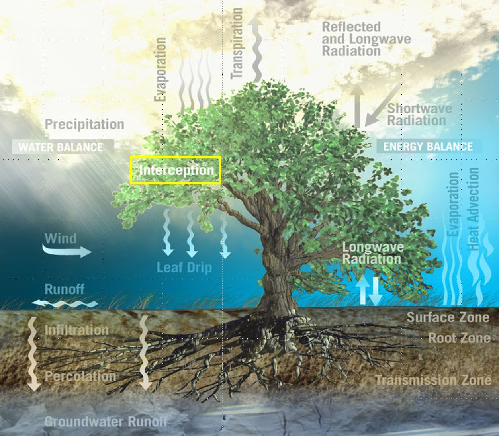
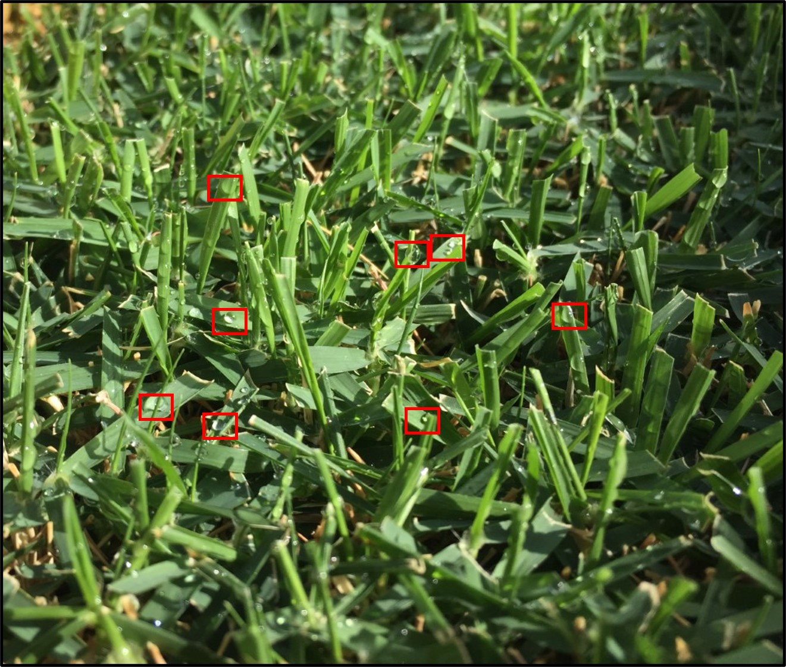
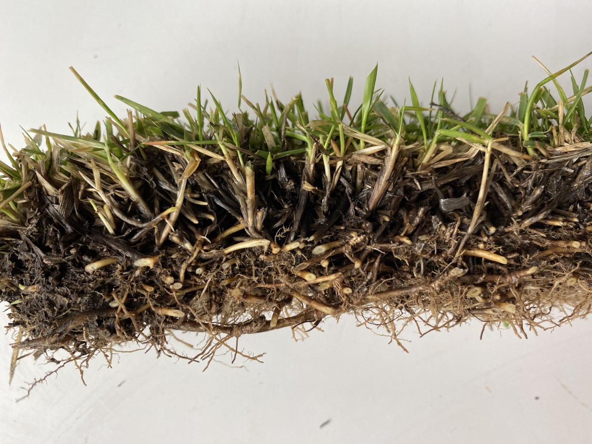
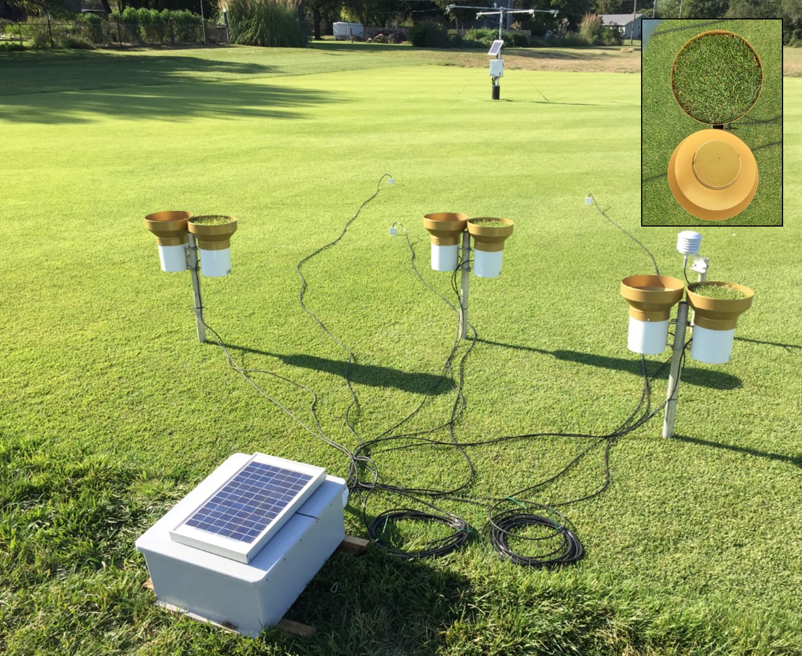

# Canopy Interception in Turfgrass Systems

**Name:** Wes Dyer 
**Semester:** Spring 2020

## Rationale
Canopy interception is defined as rainfall which is intercepted by and evaporated from plant canopies or plant residue and is one of many processes that is involved in the soil water balance. Canopy interception can have a signicant role in reducing the amount of water that reaches the soil surface. Agricultural crops such as corn may intercept 20% to 30% of rainfall as it matures, interception values for a tallgrass praire can range from 25% upward to 60%, and a deciduous forest can intercept around 30% precipitation. Models have been developed to describe interception, however interception in turfgrass systems has not been well-defined. Interception in a turfgrass canopy occurs when precipitation is retained and redistributed to the soil (throughfall and stemflow) and evaporated from the plant leaves. Understanding the interception dynamics associated with turfgrass will allow one to make better irrigation decisions, particulary the amount of water to apply. Prelimary results have shown some turfgrass species can intercept 5 to 10 mm of rainfall.   

 
Figure 1: The process of the soil water balance and surface energy balance.

When raindrops fall on turfgrass, water may flow through gaps in the canopy (throughfall), flow along stems to the soil surface (stemflow) or  evaporate from the surface of the canopy. The total amount of water intercepted from plant canopies can be defined as:  
 
 **Interception = Rainfall - (Throughfall + Stemflow)**  
 
 
 
 
 

Figure 2: (Top image) Raindrops intercepted by and collected on the surface of leaves. Utimately, these waterdrops will be evaporated back into the atmosphere. (Bottom Image) The verdure layer depiciting the leaves, stems, rhizomes and stolons. The process of water passing through this layer into the soil surface is defined as throughfall and stemflow. 
 
 
Measuring interception from plant canopies can pose some challenges. However, our setup to measure interception in turfgrass included paired rain gauges (TE525MM-L Campbell Sci.), one to measure precipitation and one to measure throughfall. To measure throughfall, circular turfgrass patches (zoysiagrass) were cut and placed to cover the entire diameter of the sensor. Data was collected in 1-minute rainfall records. In this notebook, we will examine how key componets such as duration, intensity and amount from a rainfall event influence canopy interception in a turfgrass.
 

 
Figure 3: Research setup depiciting paired rain gauges. Precipitation measured in open rain gauges and throughfall measured in rain gauge with turfgrass patch.

## References 
* Balogh, J.C. and Walker, W.J. (1992) *Golf Course Management & Construction: Environmental Issues.*

* Dunkerley, D. (2000), Measuring interception loss and canopy storage in dryland vegetation: a brief review and evaluation of available research strategies. Hydrol. Process., 14: 669-678.36.

* Zou CB, Caterina GL, Will RE, Stebler E, Turton D. Canopy Interception for a Tallgrass Prairie under Juniper Encroachment. PLoS One. 2015;10:e0141422. doi: 10.1371/journal.pone.0141422.
